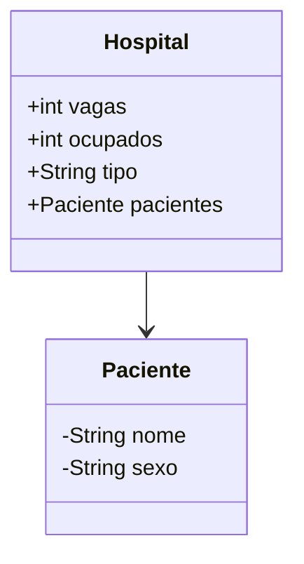

```mermaid
classDiagram
Hospital --> Paciente
class Hospital{
    +int vagas
    +int ocupados
    +String tipo  
    +Paciente pacientes 
}

class Paciente{
    -String nome
    -String sexo
}
```
